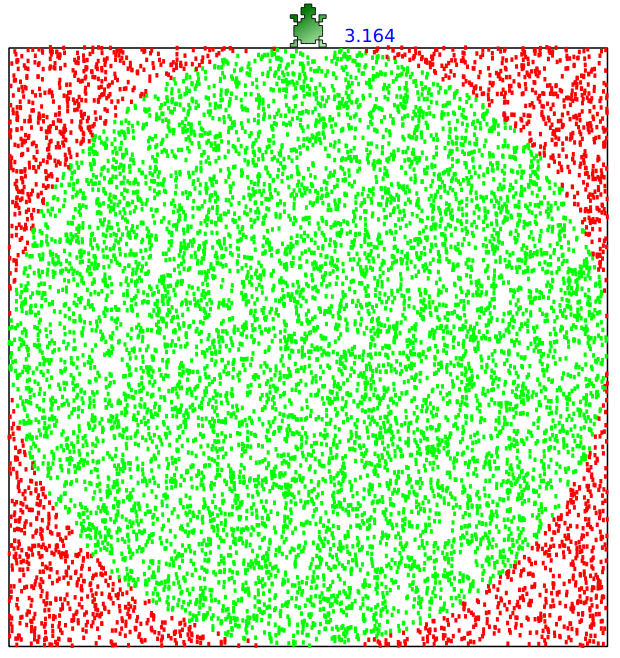

# Projetos e Algoritmos em TurtleScript

Conjunto de projetos e algoritmos desenvolvidos utilizando a linguagem TurtleScript.

## Exemplos de alguns algoritmos em TurtleScript

A seguir são listados alguns exemplos de algoritmos utilizando a linguagem TurtleScript. Estes algoritmos são encontrados dentro da pasta [[`code`](./code/)].

| Nome Arquivo Local                        | Imagem                                        |
|-------------------------------------------|-----------------------------------------------|
| pi-monte-carlo.turtle                     |                |
| bandeira-brasil.turtle                    |         |
| triangulo-sierpinski.turtle               |      |
