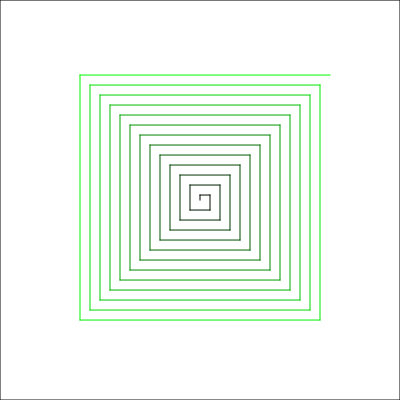
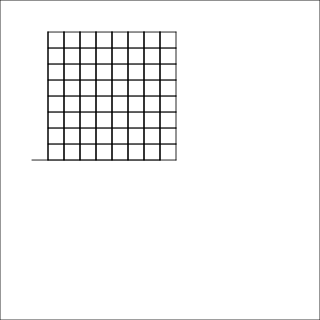
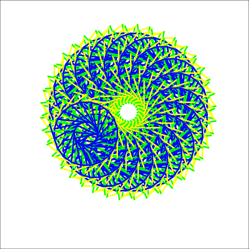
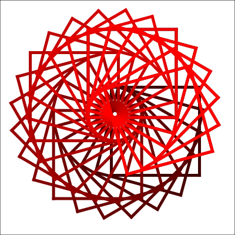
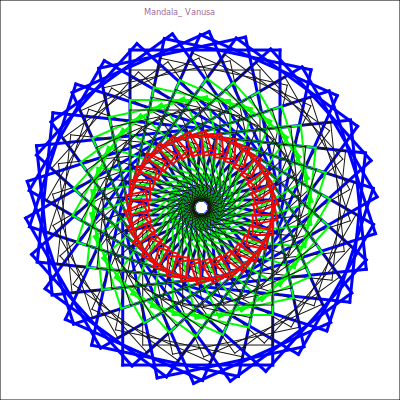
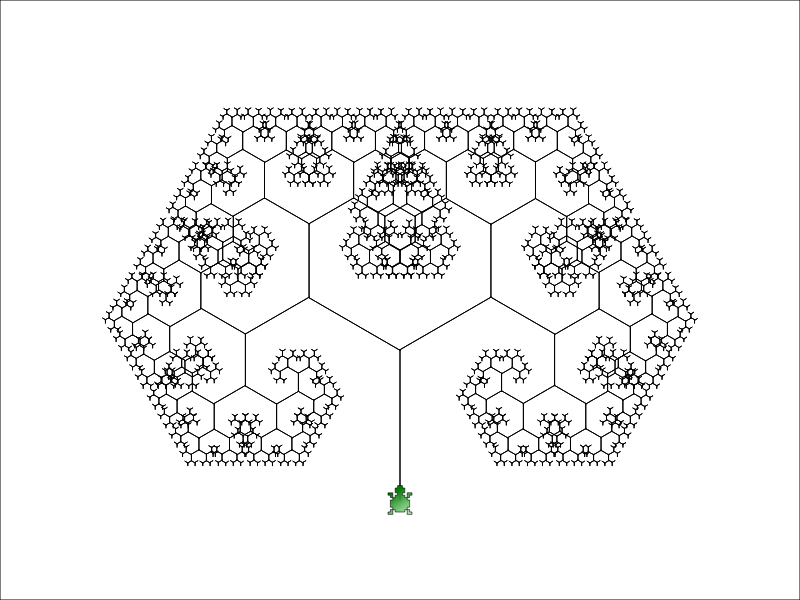
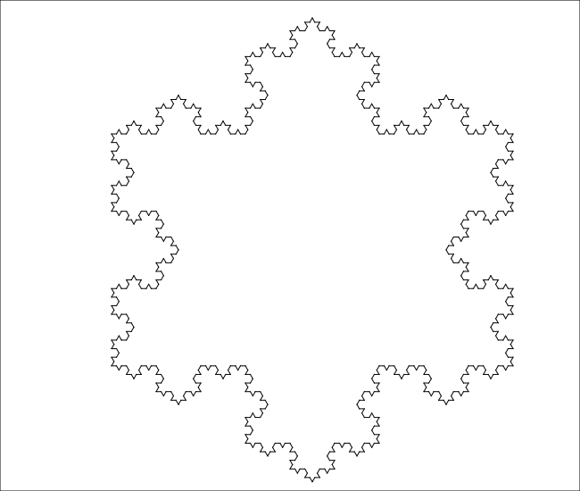

# Projetos e Algoritmos em TurtleScript

Conjunto de projetos e algoritmos desenvolvidos utilizando a linguagem TurtleScript.

## Exemplos de alguns algoritmos em TurtleScript

A seguir são listados alguns exemplos de algoritmos utilizando a linguagem TurtleScript. Estes algoritmos são encontrados dentro da pasta [[`code`](./code/)].

| Nome Arquivo Local                        | Imagem                                              |
|-------------------------------------------|-----------------------------------------------------|
| espiral.turtle                            |                       |
| tabuleiro.turtle                          |                     |
| mandala.turtle                            |                       |
| mandala2.turtle                           |                      |
| mandala-aluna-vanusa.turtle               |          |
| bandeira-brasil.turtle                    |               |
| pi-monte-carlo.turtle                     |                      |
| tree.turtle                               |                          |
| fractal-curva-de-koch.turtle              |         |
| fractal-floco-de-neve.turtle              |        |
| fractal-triangulo-sierpinski.turtle       |  |

