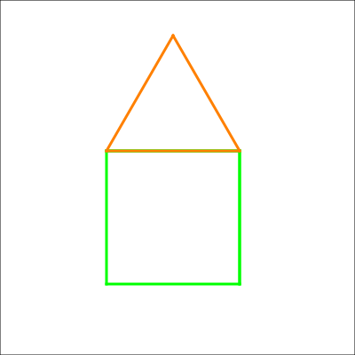
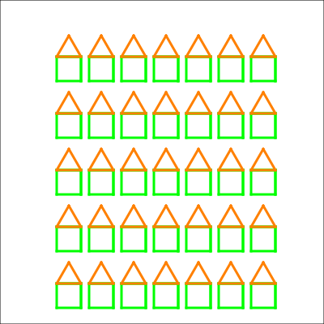
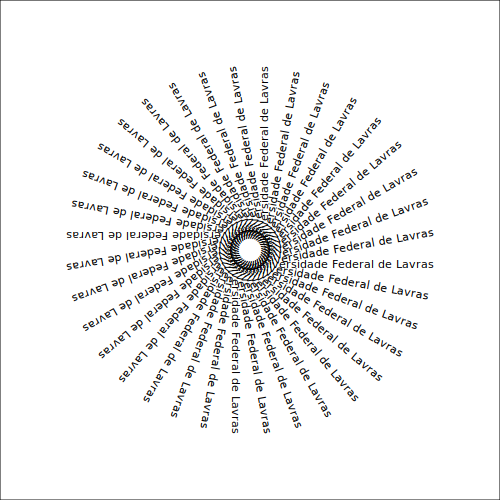
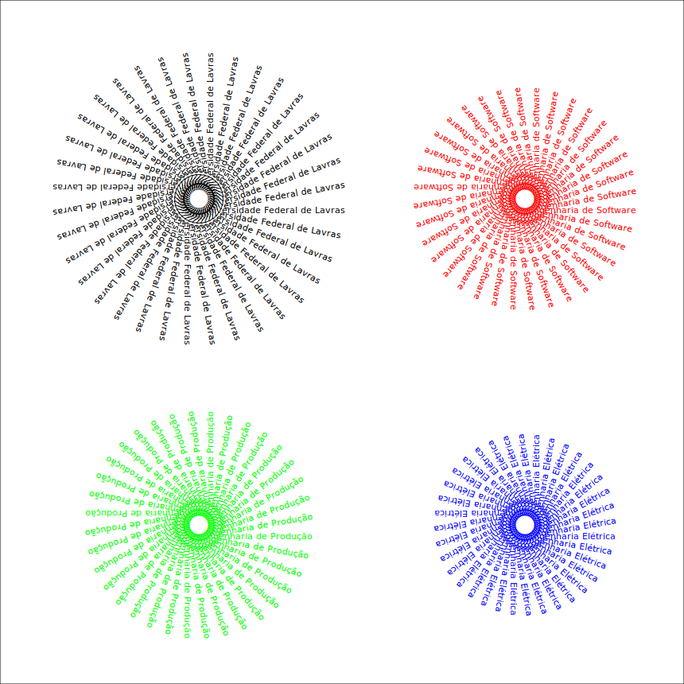
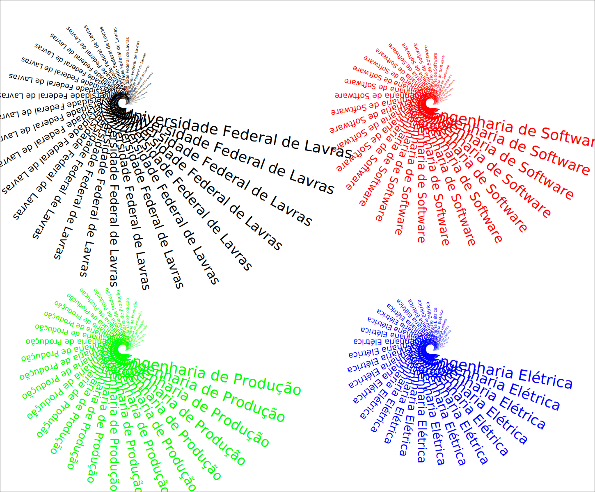
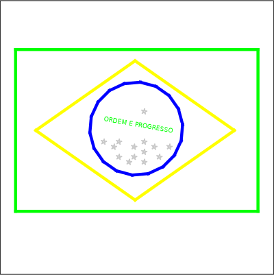
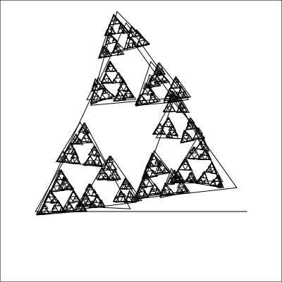
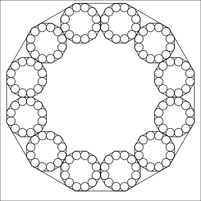

# Projetos e Algoritmos em TurtleScript

Conjunto de projetos e algoritmos desenvolvidos utilizando a linguagem TurtleScript.

  
<b>🛠️ Projeto (GIF): Mandala:</b>

   
  

    
  

  
<b>🛠️ Projeto (GIF): Mandala 2:</b>

   
  

    
  

  
<b>🛠️ Projeto (GIF): Flores:</b>

   
  

    
  

  
<b>🛠️ Projeto (GIF): Movimento Browniano:</b>

   
  

    
  

## Exemplos de alguns algoritmos em TurtleScript

A seguir são listados alguns exemplos de algoritmos utilizando a linguagem TurtleScript. Estes algoritmos são encontrados dentro da pasta [[`code`](./code/)].

| Nome Arquivo Local                        | Imagem                                              |
|-------------------------------------------|-----------------------------------------------------|
| espiral.turtle                            |                       |
| tabuleiro.turtle                          |                     |
| mandala.turtle                            |                       |
| mandala2.turtle                           |                      |
| mandala-aluna-vanusa.turtle               |          |
| casa.turtle                               |                          |
| casas.turtle                              |                         |
| escrita-ufla0.turtle                      |                 |
| escrita-ufla1.turtle                      |                 |
| escrita-ufla2.turtle                      |                 |
| flores.turtle                             |                        |
| movimento-browniano.turtle                |           |
| bandeira-brasil.turtle                    |               |
| pi-monte-carlo.turtle                     |                      |
| tree.turtle                               |                          |
| fractal-curva-de-koch.turtle              |         |
| fractal-floco-de-neve.turtle              |        |
| fractal-triangulo-sierpinski.turtle       |  |
| fractal-octogono.turtle                   |              |
| fractal-cruz.turtle                       |                  |
| fractais-jesimar.turtle                   |    |
| fractais-jesimar.turtle                   |   |
| fractais-jesimar.turtle                   |   |
| fractais-jesimar.turtle                   |   |
| fractais-jesimar.turtle                   |   |
| fractais-jesimar.turtle                   |    |
| fractais-jesimar.turtle                   |   |
| fractais-jesimar.turtle                   |    |
| fractais-jesimar.turtle                   |    |
| fractais-jesimar.turtle                   |    |
| fractais-jesimar.turtle                   |  |
